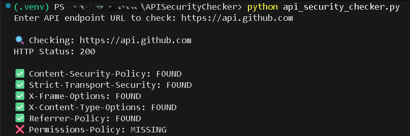
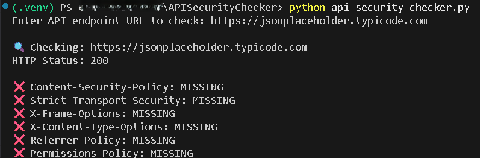
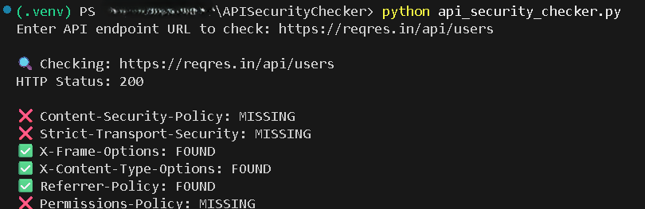

# 🧩 API Security Checker

A Python-based utility that checks a given API endpoint for essential security headers.

## :bust_in_silhouette: Author

**Edward Hudson Jr.**  
Aspiring Cybersecurity Professional | Building Experience Through Hands-On Projects and Labs.

---

## ⚙️ Installation

```bash
git clone https://github.com/ehudson92/APISecurityChecker.git
cd APISecurityChecker
python -m venv .venv
.\.venv\Scripts\activate
pip install -r requirements.txt
```

## :rocket: Usage

```bash
python api_security_checker.py
```

when prompted, enter a full API URL, for example:

```bash
https://api.github.com
```

The app will check for headers such as:

- Content-Security-Policy
- Strict-Transport-Security
- X-Frame-Options
- X-Content-Options
- Referrer-Policy
- Permissions-Policy

## :brain: 🧾 Example Screenshots

Below are real test results from the API Security Checker:

| Example | Description | Screenshot |
|----------|--------------|-------------|
| 1 | Checking GitHub API Headers |  |
| 2 | Checking JSONPlaceholder API Headers |  |
| 3 | Checking Reqres API Headers |  |

📧 Contact: <edward.cybersec@proton.me>

🌐 Portfolio: <https://ehudson92.github.io>
